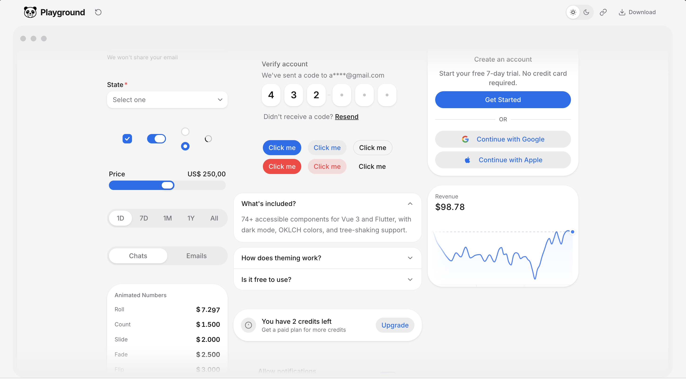

<p align="center">
  
</p>

<h1 align="center">Ousi UI</h1>

<p align="center">
  A beautiful, accessible component library for <strong>Vue</strong> and <strong>Flutter</strong>.<br/>
  74+ components. Dark mode. OKLCH colors. TypeScript-first.
</p>

<p align="center">
  <a href="https://ousiui.com">Documentation</a> &middot;
  <a href="https://ousiui.com/playground">Playground</a> &middot;
  <a href="https://ousiui.com/vue/components/button">Components</a> &middot;
  <a href="https://github.com/carlosaroca/ousi-ui/issues">Report Bug</a>
</p>

<p align="center">
  
  
  
</p>

<br/>

<p align="center">
  <a href="https://ousiui.com/playground">
    
  </a>
</p>

---

## Features

- **74+ Components** — Buttons, forms, date pickers, charts, color pickers, modals, and more
- **Vue 3 + Flutter** — Vue ready today, Flutter coming soon
- **Tailwind CSS v4** — CSS-first configuration, no JS config files
- **Dark Mode** — Every component adapts via `data-theme` attribute
- **OKLCH Color System** — Perceptually uniform colors with `color-mix()` for hover/soft states
- **TypeScript** — Full type safety with exported prop types, emits, and slots
- **Accessible** — WAI-ARIA compliant, keyboard navigation, screen reader support
- **Tree-Shakeable** — Import only what you use
- **Theme Playground** — Customize accent, radius, font, and export CSS tokens

## Quick Start

```bash
pnpm add @ousi-ui/vue @ousi-ui/theme
```

### Configure Tailwind v4

```css
/* main.css */
@import "tailwindcss";
@import "@ousi-ui/theme";
```

```ts
// vite.config.ts
import tailwindcss from '@tailwindcss/vite'

export default defineConfig({
  plugins: [tailwindcss()],
})
```

### Use Components

```vue
<script setup>
import { OButton } from '@ousi-ui/vue'
</script>

<template>
  <OButton variant="primary" size="md">
    Get Started
  </OButton>
</template>
```

## Components

| Category | Components |
|----------|-----------|
| **Buttons** | Button, ButtonGroup, MagneticButton |
| **Forms** | Input, Textarea, Select, Autocomplete, Checkbox, Radio, Switch, Slider, ElasticSlider, NumberField, InputOtp, TagInput, Rating, FileUpload, Form |
| **Date & Time** | Calendar, RangeCalendar, DateField, TimeField, DatePicker, DateRangePicker |
| **Colors** | ColorSwatch, ColorField, ColorSlider, ColorArea, ColorPicker |
| **Data Display** | Badge, Chip, Table, Kbd, Chart, CodeBlock, AnimatedNumber, Timeline |
| **Feedback** | Alert, ProgressBar, ProgressCircle, Meter, Skeleton, Spinner, Toast |
| **Layout** | Card, Separator, BentoGrid, AspectRatio, Resizable |
| **Media** | Avatar, Carousel, ImageCompare |
| **Navigation** | Disclosure, Breadcrumbs, Pagination, Tabs, Accordion, Stepper, TreeView |
| **Overlays** | Dialog, Drawer, Dropdown, Popover, Tooltip, ContextMenu, CommandPalette |
| **Interactive** | Collapsible, InfiniteScroll, ScrollShadow |
| **Trendy** | Marquee, Dock, Typewriter, GradientText, Confetti |

## Theming

Ousi UI uses CSS custom properties. Switch themes instantly:

```js
document.documentElement.setAttribute('data-theme', 'dark')
```

Customize any token:

```css
:root {
  --ousi-accent: oklch(0.62 0.195 254);
  --ousi-radius: 0.75rem;
  --ousi-font-sans: 'Inter', system-ui, sans-serif;
}
```

Or use the [Playground](https://ousiui.com/playground) to build your theme visually and export the CSS.

## Packages

| Package | Description |
|---------|-------------|
| `@ousi-ui/vue` | Vue 3 components |
| `@ousi-ui/theme` | CSS themes & design tokens |
| `@ousi-ui/tokens` | TypeScript token definitions |
| `@ousi-ui/core` | Shared composables & utilities (bundled into vue) |
| `@ousi-ui/nuxt` | Nuxt module (coming soon) |

## Development

```bash
# Clone
git clone https://github.com/carlosaroca/ousi-ui.git
cd ousi-ui

# Install
pnpm install

# Build all packages
pnpm build

# Start docs dev server
pnpm dev --filter @ousi-ui/docs

# Start playground
pnpm dev --filter @ousi-ui/playground
```

## Tech Stack

- **Vue 3.5+** — Composition API, `<script setup>`
- **Tailwind CSS v4** — `@theme inline`, CSS-first
- **CVA** — Class Variance Authority for type-safe variants
- **motion-v** — Vue port of Framer Motion for animations
- **@floating-ui/vue** — Positioning for tooltips, popovers, dropdowns
- **clsx + tailwind-merge** — Class merging via `cn()` utility
- **Vite** — Build tooling
- **pnpm** — Package manager with workspaces
- **Turborepo** — Monorepo orchestration

## Contributing

See [CONTRIBUTING.md](CONTRIBUTING.md) for guidelines.

## License

[MIT](LICENSE) &copy; [Carlos Aroca](https://carlosaroca.com)
